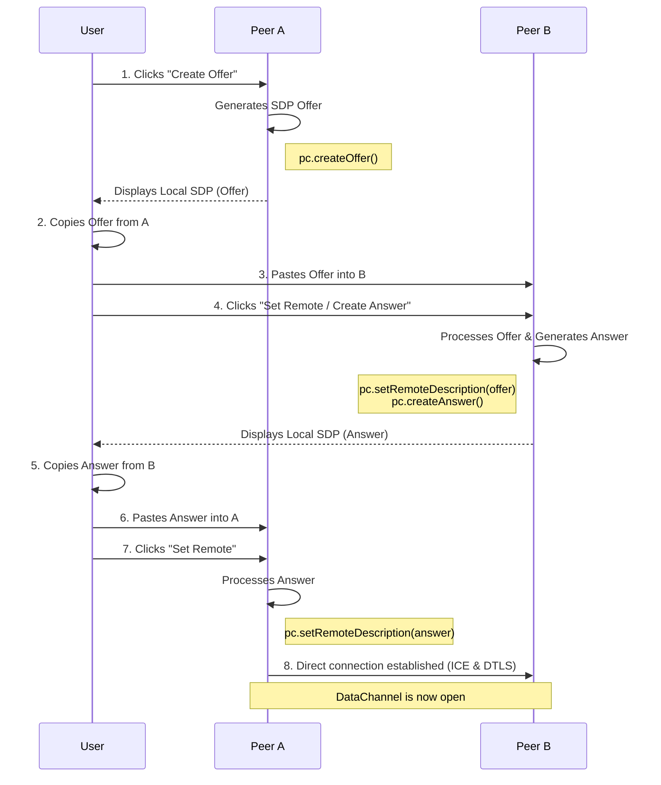

# Chrome LAN Share

Peer-to-peer message & file sharing Chrome extension for LAN use.  
Implements WebRTC (Web Real-Time Communication) DataChannel with **manual or automated signaling** (copy/paste SDP or local WebSocket server). No server required for manual mode.

## How to install (developer mode)
1. Save the project folder (contains `manifest.json`, `popup.html`, `popup.js`, `styles.css`).
2. In Chrome, go to `chrome://extensions/` → enable **Developer mode** → **Load unpacked** → select the folder.
3. Click the extension icon to open the popup on two (or more) machines on your LAN.

## Quick usage

### Manual Signaling (Default)
- On Device A: Click **Create Offer**. Wait for ICE (Interactive Connectivity Establishment) gathering to complete (status shows "ICE: complete"). The Local SDP (Session Description Protocol) textarea will populate with the offer. Click **Copy Local SDP** (or manually copy the text), then paste it into Device B's Remote SDP textarea.
- On Device B: Paste the offer into Remote SDP, then click **Set Remote / Create Answer**. The Local SDP textarea will populate with the answer. Copy it and paste back into Device A's Remote SDP.
- On Device A: Paste the answer into Remote SDP, then click **Set Remote**.
- Wait until DataChannel opens (status updates), then send messages & files.

### Automated Signaling (Optional)
- Install dependencies: Run `npm install` in the project directory.
- Run the server: `npm start` or `node server.js` on a machine accessible to both devices (it binds to 0.0.0.0 for LAN access).
- On both devices: Check "Use Signaling Server", enter the server address (e.g., `192.168.1.100:8080` for remote, or `localhost:8080` for local), and click "Connect to Server".
- On Device A: Click **Create Offer**.
- On Device B: Click **Wait for Offer**.
- Connections establish automatically without manual copying.

## How It Works: WebRTC & SDP

This extension is built on two core web technologies: **WebRTC** and **SDP**.

### WebRTC (Web Real-Time Communication)

WebRTC is a technology that enables web browsers to stream audio, video, and arbitrary data in real-time directly to each other (peer-to-peer). This means data can be sent from one browser directly to another without passing through a central server.

In this extension, we use:
-   **`RTCPeerConnection`**: To establish and manage the connection between two users on the LAN.
-   **`RTCDataChannel`**: To create a communication channel for sending text messages and file chunks.

### SDP (Session Description Protocol)

Before two browsers can connect via WebRTC, they need to exchange information about the connection. This process is called **signaling**, and the information they exchange is formatted using **SDP**.

An SDP message is a block of text that describes the session, answering questions like:
-   What kind of data are we sending (e.g., a data channel)?
-   What are the network addresses where I might be reachable (known as ICE candidates)?
-   What security protocols will we use?

This extension uses **manual signaling**: you are the signaling server! By copying the "offer" SDP from one peer and pasting it into the other, and then copying the "answer" SDP back, you are providing both browsers with the information they need to find each other and establish a direct connection.

The communication flow looks like this:



## Notes & limitations
- Files are sent via ordered DataChannel and reconstructed on the receiver.
- For more convenience, automated signaling via a local WebSocket server is supported (optional).

### Connecting Over the Internet (NAT Traversal)

By default, this extension is configured for local network (LAN/Wi-Fi) use with basic internet support via STUN. The `iceServers` list in the WebRTC configuration includes a public STUN server.

-   **ICE (Interactive Connectivity Establishment)** is the process WebRTC uses to find the best path to connect peers. It does this by gathering network addresses (candidates).
-   With the STUN server, it can gather public IP addresses, allowing connections over the internet in many cases.

For more reliable internet connections, you can add a TURN server to the configuration in `popup.js`:

```javascript
// in popup.js
pc = new RTCPeerConnection({
    iceServers: [
        { urls: 'stun:stun.l.google.com:19302' },
        { urls: 'turn:turn.example.com:3478', username: 'user', credential: 'pass' }  // Replace with actual TURN server
    ]
});
```

## Security
- Only exchange SDP with trusted devices.
- This demo does not include authentication — for production, add pairing tokens or passcodes and encryption.

## License
This project is licensed under the MIT License - see the [LICENSE](LICENSE) file for details.
